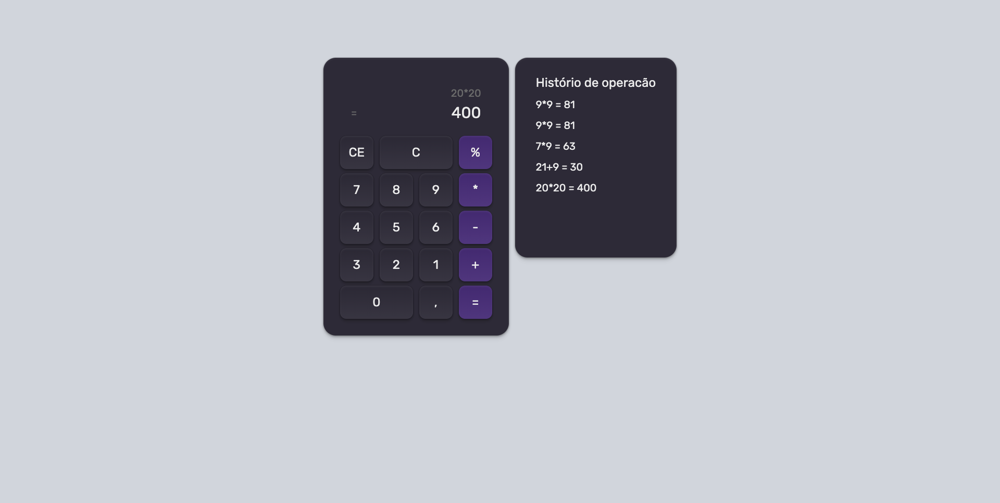

# 🧮 Calculadora React

Uma calculadora desenvolvida em **React** que permite realizar diversas operações matemáticas e salvar o **histórico das operações** realizadas.  
O projeto foi criado com o objetivo de **aprender os conceitos iniciais do React**, como componentes, estados e manipulação de eventos.

---

## ⚙️ Funcionalidades

- ➕ Realiza operações básicas (soma, subtração, multiplicação e divisão);  
- 💾 Armazena o histórico das operações realizadas;  
- 🧹 Permite limpar o histórico;  
- 🕹️ Interface simples e responsiva;  
- ⚡ Atualização automática dos resultados conforme a digitação.

---

## 🧰 Tecnologias utilizadas

- **React** — Biblioteca JavaScript para criação de interfaces;  
- **HTML5** e **CSS3** — Estrutura e estilização da aplicação;  
- **Tailwind** - Estilização da aplicação;
- **LocalStorage** — Para persistência do histórico de operações.

---

## 🖼️ Projeto

  

